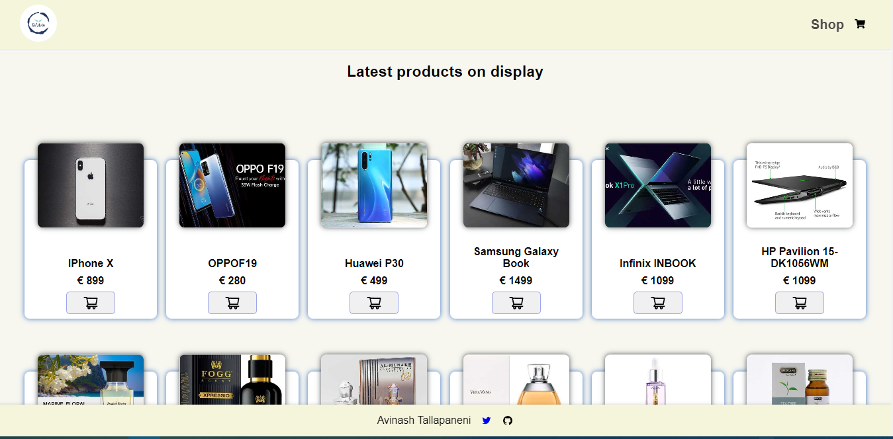

# Tallavin Ecommerce

## Introduction

My first React-js e-commerce project called Tallavin Ecommerce. It was built using React and the Vite build tool. I have implemented basic features like product listing from dummy json, shopping cart functionality, checkout process, and more.

## Technologies Used

The Tallavin Ecommerce is built using React-JS along with context Api

## Screenshot

## Author

My name is Avinash Tallapaneni, and I am a front-end web developer based in Chennai, India. I am passionate about coding and building applications that make a difference in people's lives.

- Website - [Preview site on vercel](https://tallavin-ecommerce.vercel.app/)
- Twitter - [@TallapaneniAvi](https://www.twitter.com/TallapaneniAvi)

## Got feedback?

i love receiving feedback! So if you have anything you'd like to mention, please email avinashtallapaneni[at]gmail[dot]com or message me on socials
